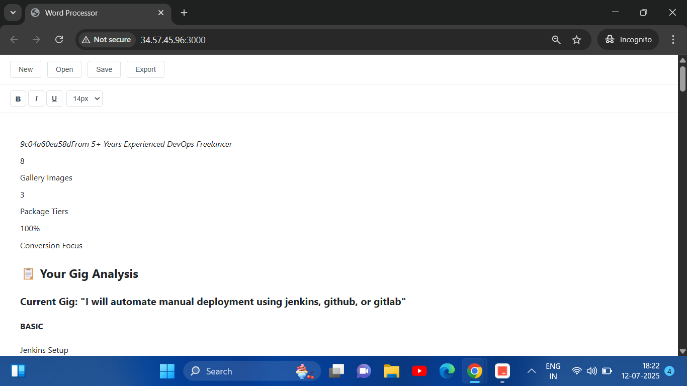

## Collaborative Document Editor

### Description

This project is a real-time collaborative document editor. It allows multiple users to create, edit, and format documents simultaneously. The editor provides a rich text editing experience, similar to Google Docs or Microsoft Word Online.

### Screenshot



### Tech Stack

- **Backend:** Node.js, Express, TypeScript
- **Frontend:** React, Tiptap (a rich-text editor framework)
- **Containerization:** Docker, Docker Compose

### Features

- Rich text editing with formatting options
- Document creation, saving, and export
- File upload and management
- Responsive design
- Dockerized deployment

### Getting Started

```bash
# Clone the repository
git clone <repository-url>

# Navigate to project directory
cd collaborative-document-editor

# Run with Docker Compose
docker-compose up --build
```

The application will be available at:
- Frontend: http://localhost:3000
- Backend API: http://localhost:5000

---

Created by Sushant Sonbarse
[GitHub](https://github.com/sonbarse17)